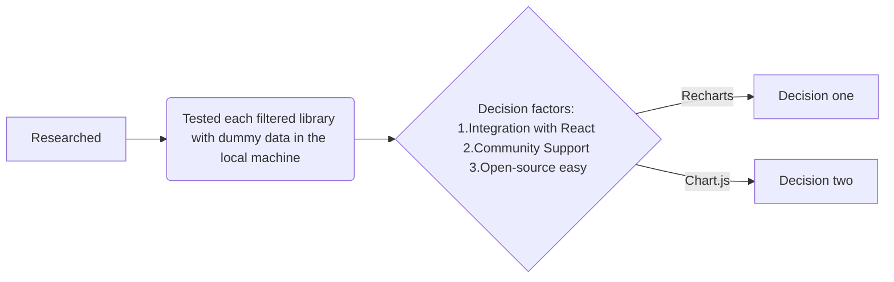

**Decision-making process to select an alternative visualization library instead of HighCharts**

- # General structure of the decision

- # Dialogue Process
- Khosiyat filtered (researched and tested 6 libraries in the local machine  with dummy data) the top 6 visualization libraries(provided in the table below) and she chose Recharts ( because of 1)Integration with React. 2) Active Development and Community Support 3) Easy 4) MIT License )
- Mathieu suggested `Chart.js` ( because of  1) Community Support 2) Well documentation 3) Easy to apply )
- Whui-Mei suggested `GNUPLOT`. Khosiyat's objection to GNUPLOT and alternative suggestion is: `Chart.js` surpasses `Gnuplot` in several aspects, including a large community, extensive documentation, a library with a quick setup, and more straightforward integration.
- The tech team, Yuliia, Zuzanna, and Khosiyat agreed to use `Chart.js`.

- # Researched Libraries
| Library            | Pros                                                         | Cons                                       | GitHub Repository I researched                                         |
|--------------------|--------------------------------------------------------------|--------------------------------------------|-------------------------------------------------------------|
| **D3.js with React**| **$${\color{green} FLEXIBLE.for.custom.visualizations-BSD 3 Clause License}$$**| **$${\color{red}Steeper .learning .curve}$$**                 | [D3.js](https://github.com/d3/d3), [React D3 Library](https://github.com/react-d3-library/react-d3-library)               |
| **Chart.js with React** | - Simple and easy to use **-MIT License**                                     | - Limited customization options            | [Chart.js](https://github.com/chartjs/Chart.js), [React Chartjs 2](https://github.com/jerairrest/react-chartjs-2)         |
| Victory            | - Designed specifically for React **-built on top of D3.js and  provide React components for creating charts and visualizations**                            | - Limited chart types compared to D3.js    | [Victory](https://github.com/FormidableLabs/victory)          |
| Nivo               | - Rich set of customizable charts **-built on top of D3.js and  provide React components for creating charts and visualizations**                             | - May be overkill for simple visualizations | [Nivo](https://github.com/plouc/nivo)                       |
| **Recharts**       | **$${\color{green}1)Integration.with.React. 2).Active Development .and .Community .Support-MIT License}$$**     | **$${\color{red}Limited .compared .to D3.Js .in .advanced .customization. But .it.can.satisfy.our.project's.requirments }$$** | [color{red}Recharts](https://github.com/recharts/recharts)           |
| React-Vis          | - Provides a set of flexible and expressive charts **-MIT License**           | - Less feature-rich compared to some other libraries | [React-Vis](https://github.com/uber/react-vis)            |

