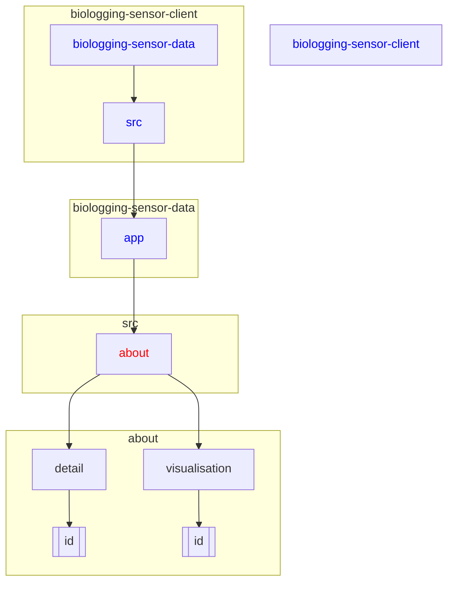

# Updating the About Page Content

## Keywords of folders and files
src, app, about, page.tsx, About.tsx, about.css

## Directory
```
biologging-sensor-client\biologging-sensor-data\src\app\about
```

```
├───about
├───detail
│   └───[id]
└───visualisation
    └───[id]
```



<details>
  <summary><strong>See Further Details</strong></summary>

## Locate the Files

1. Navigate to the `src` folder of your project.
2. Inside the `src` folder, locate the `app` folder.
3. Within the `app` folder, you'll find the `about` folder containing the relevant files for the About page:
   - `page.tsx`
   - `About.tsx`
   - `about.css`

## Open `About.tsx` for Content Modification

1. Open the `About.tsx` file using a text editor or integrated development environment (IDE).

## Update the Text Content

1. Within the `About` component in `About.tsx`, you'll find paragraphs and headings that you can modify.
2. Update the text content according to your requirements. You can add, remove, or modify paragraphs, headings, and links as necessary.
   - For example, if you want to update the description of SBDI Biologging tools, modify the paragraphs inside the component.

## Optional: Modify Styling in `about.css`

1. If you need to adjust the styling of the About page, you can do so in the `about.css` file located in the same directory.
2. For instance, if you want to change the padding of the `section` element, you can modify the `padding-top` property in the `about.css` file.


</details>
