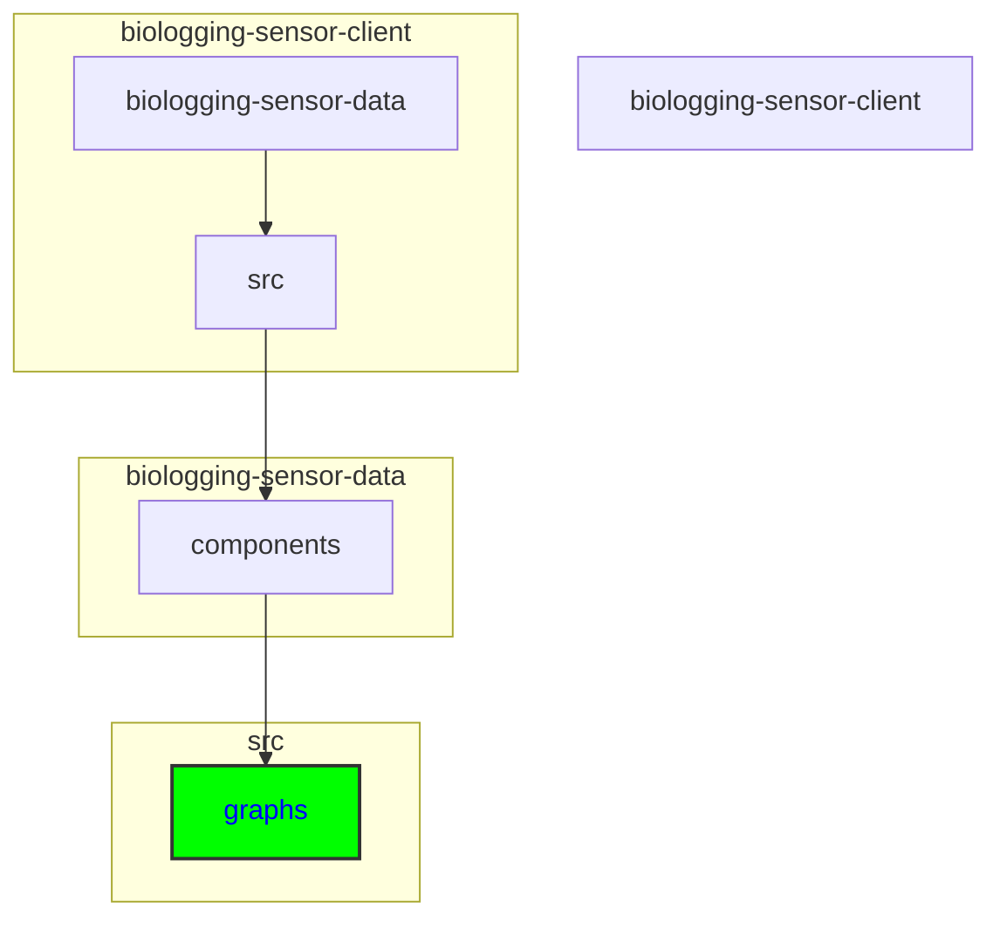

# Adding a New Diagram to the Client Application

## Keywords of folders and files
components, graph, diagram, Actogram, Line Chart, Map, DiagramName.tsx, MapComponent.tsx, MapGraph.tsx, Polylines.tsx, MapGraph.css, Actogram.tsx, ActogramGraph.tsx, const.ts, interface.ts, api, dataset, event, instrument, organism, project, record

## Directory
```
biologging-sensor-client\biologging-sensor-data\src\components\graphs
```

```
├───graphs
│   ├───actogram
│   ├───line
│   └───map
└───overview
```





<details>
  <summary><strong>See Further Details</strong></summary>
  
## Main Steps

To add a new diagram to the client application, follow these steps:

### 1. Identify the Diagram Type:

Determine the type of diagram you want to add (e.g., Actogram, Line Chart, Map).

### 2. Create a New Diagram Component:

- Inside the "components" folder in the "src" directory, locate the "graph" folder.
- Depending on the diagram type, you may need to create a new folder for the diagram within the "graph" folder.
- Create a new file for the diagram component. For example, if adding a new line chart, create a new file named <DiagramName>.tsx inside the appropriate folder (e.g., "line" OR "chart" folder).
- Implement the logic and rendering code for the diagram component based on your requirements.
- Ensure to import any necessary dependencies and define interfaces or types as needed.

### 3. Integrate the Component into Existing Pages:

- Identify the pages or components where you want to display the new diagram.
- Import the newly created diagram component into these pages or components.
- Pass any required data or props to the diagram component to populate it with data.
- Ensure to update the rendering logic of the parent components to include the new diagram component.

### 4. Update Styling (if necessary):

- Apply any necessary styling to the new diagram component to ensure it matches the visual style of the existing application.
- You can add or modify CSS files associated with the diagram component for styling purposes.

## Files to Edit or Create

### For Line Chart (Example):

- Inside the "graph" folder, locate the "line" folder.
- Create a new file named <DiagramName>.tsx for the line chart component.
- Implement the logic and rendering code for the line chart component.
- Ensure to import any necessary dependencies and define interfaces or types as needed.

### For Map Component (Example):

- Inside the "graph" folder, locate the "map" folder.
- Create or modify files such as MapComponent.tsx, MapGraph.tsx, Polylines.tsx, and MapGraph.css as necessary.
- Implement the logic and rendering code for the map component and related files based on your requirements.

### For Actogram Component (Example):

- Inside the "graph" folder, locate the "actogram" folder.
- Create or modify files such as Actogram.tsx, ActogramGraph.tsx, const.ts, and interface.ts as necessary.
- Implement the logic and rendering code for the actogram component and related files based on your requirements.

## API Interfaces

API interfaces are imported from the following directory `api`:
`biologging-sensor-client\biologging-sensor-data\src\api`

Each subdirectory under api handles interactions for different types of data and includes the following key files:

- dataset: Handles dataset-related API interactions.
- event: Manages event-related API calls.
- instrument: Responsible for instrument data API interactions.
- organism: Deals with organism-related API calls.
- project: Manages project-specific API interactions.
- record: Handles record-related API data.

Each subdirectory follows the same structure but is tailored to handle its specific type of data interactions.

Example Import Statement:

```typescript
import { Record } from '@/api/record/record.interface';
```

</details>