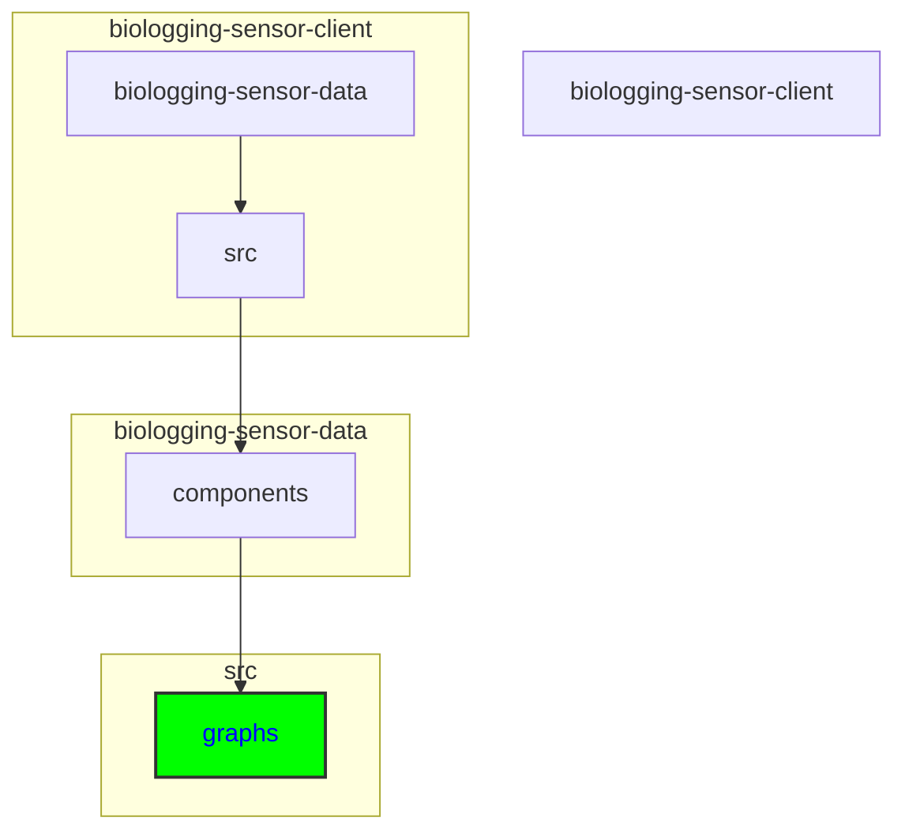

# Adding a New Diagram to the Client Application

## Keywords of folders and files
components, graph, diagram, Actogram, Line Chart, Map, DiagramName.tsx, MapComponent.tsx, MapGraph.tsx, Polylines.tsx, MapGraph.css, Actogram.tsx, ActogramGraph.tsx, const.ts, interface.ts, api, dataset, event, instrument, organism, project, record

## Directory
```
biologging-sensor-client\biologging-sensor-data\src\components\graphs
```

```
├───graphs
│   ├───actogram
│   ├───line
│   └───map
└───overview
```





<details>
  <summary><strong>See Further Details</strong></summary>
  
## Main Steps

To add a new diagram to the client application, follow these steps:

### 1. Add to information to config file

1. In *src\config\model.ts*, first create the new graph type to the type of `GraphType`. This could be first letter of the graph or something similar. 
2. Add a new class for the graph config. The structure should be as:
```
export class NewGraphC {
    parameterIfNecessary: type;
    optionalParameter?: type;

    constructor(parameterIfNecessary: type, optionalParameter: type) {
        this.parameterIfNecessary = parameterIfNecessary;
        this.optionalParameter = optionalParameter;
    }
} 
```
The new class can have, but does not have to have any parameters inside, depending on the use case. 
3. In class `ConfigItem`, firstly extend the member `graphType` with `|NewGraphC`.
4. Add a get statement above constructor:
```
get newGraphC(): NewGraphC {
    return this.graph as NewGraphC;
}
```


### 2. Create a New Diagram Component:

1. Inside the "components" folder in the "src" directory, locate the "graph" folder.
2. Create a new folder for the diagram within the "graph" folder.
3. Create a new file named <DiagramName>.tsx for the diagram component inside the folder. If any custom styling is required for the graph, a CSS file should be placed in the same folder. Make sure to import the CSS file in the tsx file (```import './NewGraphStyle.css'; ```). If the graph will be divided into multiple components, these components should be placed in the same folder as well.
4. Implement the logic and rendering code for the diagram component. Usually, you should include parameters for *events* and *config* file and any additional parameters. Export the component. 
5. Therefore, the final implementation should resemble:
```
export default function NewGraph({ events, config, anyAdditionalProps }: { events: Event[], config: NewGraphC, anyAdditionalProps: type }) {
    // implementation logic here

    return(

    )

}
```

### 3. Integrate the Component into Existing Pages:
1. To add the graph for visualisation, it needs to be registered in *src\app\visualisation\[id]\Visualisation.tsx*. In this file, locate const `SensorTypeDisplay` that is responsible for handlig the display of correct graphs. 
2. In the function, locate the switch statement. Add another *case* for the display of the new component, with all the required props, anywhere above *default* case:
```
case 'NewGraphType':
    return <NewGraph events={events} config={config.newGraphC} anyAdditionalProps={...} />
```

With this approach, rendering logic should not be broken. 
</details>