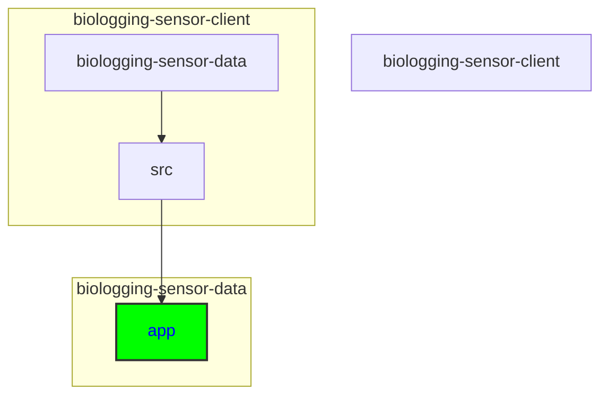

# Adding a New Page

## Keywords of folders and files
src, app, page component, Contact, Contact.tsx, Contact.css, menu, navigation, link, layout component

## Directory
```
biologging-sensor-client\biologging-sensor-data\src\app
```



<details>
  <summary><strong>See Further Details</strong></summary>
  
Below are the steps to add a new page:

## Create the Page Component

1. **Navigate to the "src" folder and locate the "app" folder.** This is where the main application components reside.

2. **Create a new folder for the new page component.** For example, if the new page is named "Contact," create a folder named "Contact" inside the "app" folder.

3. **Within the new folder, create the necessary files for the page component.** Typically, this includes a TypeScript file (e.g., Contact.tsx) and a CSS file for styling (e.g., Contact.css).

4. **Implement the logic and rendering code for the page component.** Write the TypeScript code to define the behavior and structure of the new page based on your requirements.

5. **Style the page component as needed.** Use the CSS file created for the page to apply styles and layout to the component.

## Update the Menu/Navigation

1. **Determine where you want the new page link to appear in the menu or navigation bar.** Consider the placement of the new page link in relation to existing links for optimal user experience.

2. **Locate the file responsible for rendering the menu/navigation.** This file is often found in a layout component or a separate navigation component within the project.

3. **Add a new link element for the new page in the menu/navigation component.** Ensure that the link points to the correct route for the new page component created earlier.

4. **Style the new menu item as needed.** Maintain consistency with existing menu items by applying appropriate styling to the new link element.

By following these steps, you can successfully add a new page to the application.

</details>