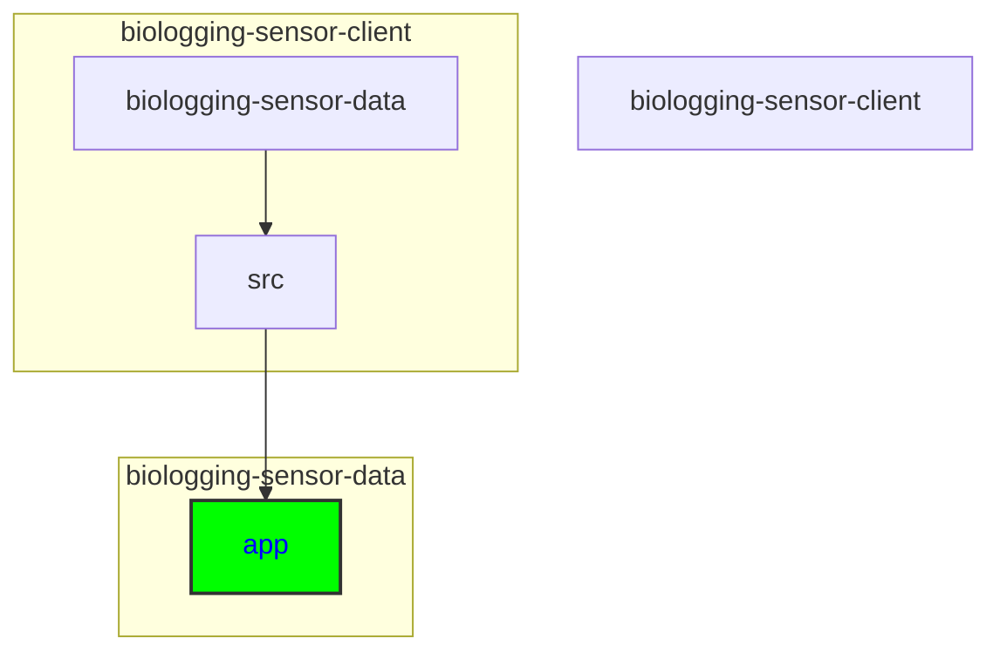

# Adding a New Page

## Keywords of folders and files
src, app, page component, Contact, Contact.tsx, Contact.css, menu, navigation, link, layout component

## Directory
```
biologging-sensor-client\biologging-sensor-data\src\app
```



<details>
  <summary><strong>See Further Details</strong></summary>
  
To add a new page, it should be placed in a specific folder and filename in the directory. The reason for this strict placing is App Router architecture which is being used in NextJS. (You can read more here: https://nextjs.org/docs/app). To add a new page, follow the steps:

## Create the Page Component

1. In *src/app* create a folder with the new page name. This page name will also be included in the URL path later. 
    - 1a: **creating dynamic routes** - if the page should contain **any parameters**, for example some object ids that should be linked dring routing to the page, create folder named *[id]* inside the new folder. For more options and information, see https://nextjs.org/docs/app/building-your-application/routing/dynamic-routes.
2. In the new folder (or any subfolder of the new folder representing new location for the page), create `page.tsx` file. This file will render the implementation in it. To implement the page, just extract the new default component (the name does not matter for routing purposes).
3. If you want to divide the logic into several components, create CSSs or any other files, it is okay to just place it in the file or wherever is desired. As long as everything is included in `page.tsx` file (or its children), it will be rendered. 

## Routing for the new page
Routing should be done using `Link` component. To keep the code clean, all link components are stored in *src\components\links.tsx*. It is recommeded to store new `Link` component there as well, but not necessary, it just makes the code more reusable.

#### Add Link to the links.tsx file

1. Create the component for linking, should have the format of:
```
export function NewPageLink({ optionalParameter, children }: LinkProps) {
    return (
        <Link href={{
            pathname: `path/to/new/page/in/directory`, // for example /newPage/[id]
            query: {
                id: datasetId
            }, // query is optional, only used for dynamic routes
        }}
            as={`${baseUrl}newpage/${optionalParameter or similar}`}>
            {children}
        </Link>
    )
}
```
`LinkProps` interface can be updated according to needs or a different interface can be used, if necessary. The `as` part is being used to display the URL path. If no optional paramter is needed, you can remove the "optionalParameter" from props.

2. To use it in specific file, for example when a text is clicked, just add the component to the related `.tsx` page. The structure is then:
```
<NewPageLink>Text here</NewPageLink>
```

3. If the routing is dynamic:
```
<NewPageLink optionalParameter="...">Text here</NewPageLink>
```

### Example: Adding new page to header menu
In the file *src/components/Banner.tsx*, locate the list component for navigation "nav". Add the link component to the list.
</details>