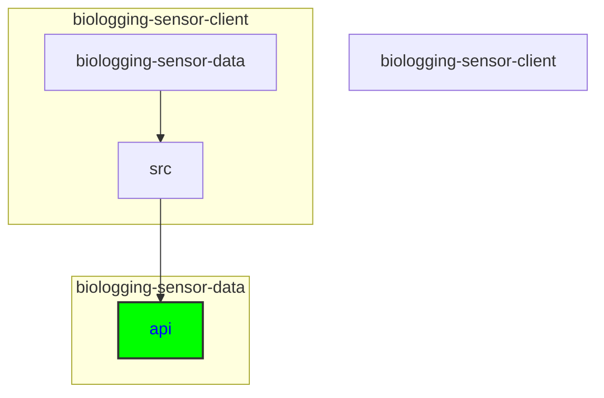

# Updating the API Data Model

## Keywords of folders and files
API, data model, interface.ts, dataset, event, instrument, organism, project, record, TypeScript interfaces, Item, Contact, Taxon, GeographicWENS, RangeDateTime, Reference

## Directory
```
biologging-sensor-client\biologging-sensor-data\src\api
```

```
├───api
│   ├───dataset
│   ├───event
│   ├───instrument
│   ├───organism
│   ├───project
│   └───record
├───app
│   ├───about
│   ├───detail
│   │   └───[id]
│   └───visualisation
│       └───[id]
├───assets
│   └───images
├───components
│   ├───graphs
│   │   ├───actogram
│   │   ├───line
│   │   └───map
│   └───overview
└───hooks
    └───sensorSelectContext
```




<details>
  <summary><strong>See Further Details</strong></summary>
  
## API Directory Structure
The API directory typically follows a structured layout, containing subdirectories for different data types such as dataset, event, instrument, organism, project, and record. Changes to the API data model may necessitate modifications to files or interfaces within these specific subdirectories.

Each object from the database is represented in specific folder in *src/api*. The folder usually has two files:
- ***object*.ts**: interface of the object, copying the response object received from the server 
- **api.ts** : handles requests

Additionally to other folderts, file **apiService.ts** is present in the directory.

### Specific Subdirectories

Each subdirectory under the API directory manages interactions for different types of data. Here are some examples:

- **dataset:** Handles dataset-related API interactions.
- **event:** Manages event-related API calls.
- **instrument:** Responsible for instrument data API interactions.
- **organism:** Deals with organism-related API calls.
- **project:** Manages project-specific API interactions.
- **record:** Handles record-related API data.

### apiService.ts
This file is located in *src/api*. It handles the logic for making a request for the server. In the file, there is implementd the request method and then the method is called within the api file of the object.  Any **new request method** should be properly implemented in the file.

### Making a request for object
To make a request for specific object from the server, it should be placed in *src/api/"object"/api.ts*. Then for each request, a method should be implemented. For example:

GET methods example for object:

```
export const newGetMethod = async (param: string): Promise<any> => {
    return await get<any>(`URL/${param}`);
}
```

POST methods example for object:
```
export const newPostMethod = async (data?: any): Promise<any> => {
    return await post<any>("url", data);
}
```

### Updating object fields
**Adding new field** - adding new field should not break any existing structure. Feel free to add it in the src/api/dataset/dataset.ts and use it in the application. 

**Modification of field** - Depending on the editor you use, you can try to rename the field which should update the name in all components. Else you have to do it manually, so find the usage of the field in project and change it. 

</details>