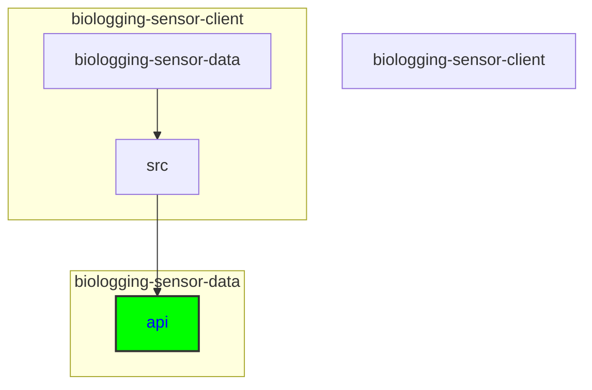

# Updating the API Data Model

## Keywords of folders and files
API, data model, interface.ts, dataset, event, instrument, organism, project, record, TypeScript interfaces, Item, Contact, Taxon, GeographicWENS, RangeDateTime, Reference

## Directory
```
biologging-sensor-client\biologging-sensor-data\src\api
```

```
├───api
│   ├───dataset
│   ├───event
│   ├───instrument
│   ├───organism
│   ├───project
│   └───record
├───app
│   ├───about
│   ├───detail
│   │   └───[id]
│   └───visualisation
│       └───[id]
├───assets
│   └───images
├───components
│   ├───graphs
│   │   ├───actogram
│   │   ├───line
│   │   └───map
│   └───overview
└───hooks
    └───sensorSelectContext
```




<details>
  <summary><strong>See Further Details</strong></summary>
  
## API Directory Structure

The API directory typically follows a structured layout, containing subdirectories for different data types such as dataset, event, instrument, organism, project, and record. Changes to the API data model may necessitate modifications to files or interfaces within these specific subdirectories.

## API Files and Interfaces

### Key Files
Within each subdirectory, key files such as `interface.ts` play a crucial role in defining the API data model. These files contain TypeScript interfaces that outline the structure of data entities, including fields and their corresponding types.

### Specific Subdirectories

Each subdirectory under the API directory manages interactions for different types of data. Here are some examples:

- **dataset:** Handles dataset-related API interactions.
- **event:** Manages event-related API calls.
- **instrument:** Responsible for instrument data API interactions.
- **organism:** Deals with organism-related API calls.
- **project:** Manages project-specific API interactions.
- **record:** Handles record-related API data.

### Contents of `interface.ts`

The `interface.ts` file within each subdirectory contains TypeScript interfaces that define the structure of specific data types. Here are some common interfaces:

- **Item:** Represents the main item structure with relevant fields.
- **Contact:** Represents contact information with fields for `firstName`, `lastName`, `email`, `userid`, and `webpage`.
- **Taxon:** Represents taxonomic coverage including fields for `taxonScientificName`, `taxonCommonName`, and `dyntexaId`.
- **GeographicWENS:** Represents geographical coverage with coordinates and a description.
- **RangeDateTime:** Represents temporal coverage with `startDatetime` and `endDatetime`.
- **Reference:** Represents bibliographic citation with `DOI` and `title`.

## Steps to Update

When changes occur in the API data model (e.g., adding new fields or modifying existing ones), developers need to follow these steps:

1. **Identification:** Identify the affected interfaces/files within the appropriate subdirectories.

2. **Modification:** Update the identified interfaces/files to reflect the changes in the data model. This may involve adding new fields, modifying existing ones, or creating new interfaces if necessary.

3. **Maintaining Layout:** Ensure that the layout remains intact by adhering to consistent naming conventions and maintaining the overall structure of the data model files.

</details>