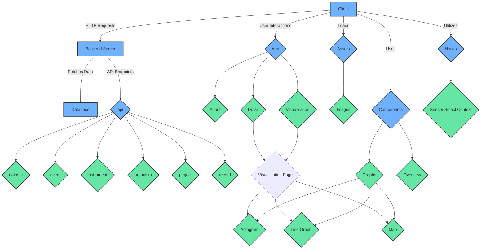
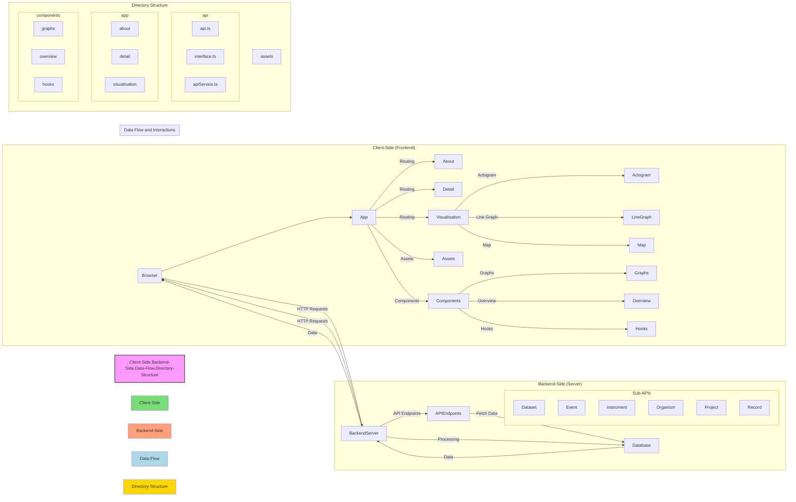

# Project Architecture Diagram



# The System Architecture
<details>
  <summary><strong>The System Architecture Diagram </strong></summary>


</details>

# Directory Breakdown

<details>
    <summary><strong>Tree of the Root Directory</strong></summary>
    
```plaintext
Root Directory
├───api
│   ├───dataset
│   ├───event
│   ├───instrument
│   ├───organism
│   ├───project
│   └───record
├───app
│   ├───about
│   ├───detail
│   │   └───[id]
│   └───visualisation
│       └───[id]
├───assets
│   └───images
├───components
│   ├───graphs
│   │   ├───actogram
│   │   ├───line
│   │   └───map
│   └───overview
└───hooks
    └───sensorSelectContext
```
</details>

<details>
  <summary><strong>api</strong></summary>
  Contains various subdirectories that handle different types of data and interactions:

# Summary of API Directory

## General Structure
## Specific Subdirectories
Each subdirectory under `api` handles interactions for different types of data and includes the following two key files:
- **dataset**: Handles dataset-related API interactions.
- **event**: Manages event-related API calls.
- **instrument**: Responsible for instrument data API interactions.
- **organism**: Deals with organism-related API calls.
- **project**: Manages project-specific API interactions.
- **record**: Handles record-related API data.

Each subdirectory follows the same structure but is tailored to handle its specific type of data interactions and definitions.


### `api.ts`
This file defines the API functions for interacting with the specific type of data-related endpoints.

### `object.ts`
This file contains TypeScript interfaces that define the structure of the specific type of data.

### `apiService.ts`
This file provides the core functions for making HTTP requests using Axios:
- **get**: 
  - **Purpose**: Performs a GET request to the specified endpoint.
  - **Implementation**: 
    - Constructs the full URL using the base URL (`BASE_API_URL`) and the given endpoint.
    - Uses Axios to send a GET request to this URL.
    - Returns the response data if the request is successful.
    - Catches any errors during the request and returns the error as an `AxiosError` type.
- **post**: 
  - **Purpose**: Performs a POST request to the specified endpoint with an optional request body and parameters.
  - **Implementation**: 
    - Constructs the full URL using the base URL (`BASE_API_URL`) and the given endpoint.
    - Uses Axios to send a POST request to this URL with the provided body and optional parameters.
    - Sets the `Content-Type` header to `application/json`.
    - Includes optional parameters, defaulting to `{ take: 100 }`.
    - Returns the response data if the request is successful.
    - Catches any errors during the request and returns the error as an `AxiosError` type.
- any new method for HTTp request should be included in this file and then used in specific subdirectory for an API call

  
</details>

<details>
  <summary><strong>app</strong></summary>
  Contains the main application structure and pages:

#### index.css
Contains global styles for the application

#### layout.tsx
The layout for the application, containing all necessary imports, styles and exteernal libraries that are to be included. 

#### page.tsx
Represent the homepage of the application.

#### Overview.tsx
A child of the homepage that containg the overview of datasets - so the table and snippet.


#### About
- url: /about
- **page.tsx** - root file to register page in route
- **About.tsx** - actual content of the about page (so if the content is modified it should be here)
- **about.css** - styling for the About page

#### Details
- url: /detail/dataset_id
- **page.tsx** - root file to register page in route, also handles errors (for example, the API for detail is not working)
- **Detail.tsx** - content of the detail page
- **detail.css** - some styling for detail page

#### Visualisation
- url: visualisation/datasetId
- **page.tsx** - root file to register page in route, containing basic skeleton for the visualisation page, which includes other components
- **DatasetList.tsx** - responsible for loading and selecting datasets on the page, displays dataset
- **SensorList.tsx** - responsible for loading and selecting sensors on the page, displays sensor list
- **Visualisation.tsx** - responsible for displaying graphs
- **interface.ts** - contains interface for sensors

</details>

<details>
  <summary><strong>assets</strong></summary>
  Contains static assets like images:

  - **images**: Directory for storing image files.
</details>

<details>
  <summary><strong>components</strong></summary>

# Graphs
## 1. `actogram` Subfolder
- contains components dedicated to visualizing actogram data. 
- Utilizes React and react-chartjs-2 for graph rendering. Utilizes React, date-fns for date manipulation, and custom API modules for data fetching.
- **Actogram.tsx** - the main parent for displaying the actogram, fetches data and creates appropriate strctures for visualisation
- **ActogramGraph.tsx** - responsible for rendering the graph
- **ActogramLegend.tsx** - provides legend for actogram
- **const.ts** - constant values used for configuring sizings and text of the actogram
- **interface.ts** - some interfaces used in actogram

## 2. `line` Subfolder
- contains components for displaying line graphs
- requires React, react-chartjs-2, and custom API modules.
- **LineGraph.tsx** - responsible for fetching data and rendering line graph displaying sensor data over time.

## 3. `map` Subfolder
- components for displaying geographical data on maps
- depends on React, react-leaflet, leaflet and custom API modules for data retrieval
- **MapComponent.tsx** - renders map based on the input data, which are coordinates
- **mapgraph.css** - styling for the map
- **MapGraph.tsx** - responsible for fetching data and renders a map with markers and polylines
- **Polylines.tsx** - styiling and rendering of each polyline based on the input data


# Overview

## 1. `table.tsx` file:

### Description:
This file contains the implementation of a table component (`OverviewTable`) for displaying dataset information. It utilizes the AG Grid component for efficient rendering and management of large datasets.

### Dependencies:
- React: For building the user interface.
- ag-Grid: A feature-rich datagrid library for displaying large datasets in tabular format.
- axios: A promise-based HTTP client for making API requests.
- date-fns: A library for manipulating dates in JavaScript.

### Components:
- `OverviewTable`: Renders a table displaying dataset information with features like sorting, filtering, and row selection.

### Features:
- Error handling: Detects and displays error messages if data loading fails.
- Row selection: Allows users to select a row and trigger a callback function (`onSelect`) with the selected dataset item.
- Cell rendering: Custom rendering of certain cells, such as temporal coverage, for improved readability.
- Grid configuration: Configures default grid options and column definitions for consistent behavior and appearance.

## 2. `Snippet.tsx` file:

### Description:
This file contains the implementation of a snippet component (`OverviewSnippet`) for displaying summarized dataset information. It provides links for accessing detailed information, visualization, and dataset download.

### Dependencies:
- React: For building the user interface.
- Font Awesome: For adding icons to enhance visual representation.

### Components:
- `OverviewSnippet`: Renders a summarized view of dataset information with links for detailed information, visualization, and download.

### Features:
- Dataset overview: Displays basic information about the dataset such as title, description, instruments, and sensors.
- Links: Provides links for accessing more detailed information, visualization, and dataset download.
- Download functionality: Allows users to download the dataset in JSON format.
- Error handling: Handles cases where dataset information is unavailable or incomplete.


</details>


# Tech Stack and Libraries Used in this project

<details>
  <summary><strong>Tech Stack</strong></summary>

- **Frontend Framework:** Next.js with TypeScript
- **Styling:** CSS, Bootstrap 3
- **Data Visualization:** react-chartjs-2 for rendering charts/graphs, react-leaflet for mapping, potentially supplemented by Leaflet library
- **HTTP Requests:** Axios for making API requests
- **Date Manipulation:** date-fns for handling dates
- **Grid Component:** ag-Grid for displaying large datasets efficiently in tabular format
- **Progress Indicators** - react-spinners package providing spinners when data are being loaded

</details>

<details>
  <summary><strong>Libraries and Dependencies</strong></summary>

- **React:** Chosen for its component-based architecture, reusability, and performance optimizations.
- **TypeScript:** Added type safety and enhanced development experience by catching errors during compile time.
- **react-chartjs-2:** Provided a simple and customizable way to render charts/graphs in React applications.
- **react-leaflet and Leaflet:** Utilized for displaying geographical data on interactive maps, offering flexibility and customization options.
- **Axios:** Used for making HTTP requests to fetch data from APIs, offering a promise-based interface and robust error handling.
- **ag-Grid:** Employed for displaying large datasets efficiently in tabular format, providing features like sorting, filtering, and row selection.
- **date-fns:** Facilitated date manipulation tasks, ensuring consistent handling of temporal data across the application.
- **CSS-in-JS Libraries (potentially):** Styled components are used for styling components, providing scoped styles and enhancing maintainability.

</details>

<details>
  <summary><strong>Reasons for Usage</strong></summary>

- **Next.js with TypeScript:** The tech team (Khosiyat, Yuliia, Zuzana) chose it because of the strong community support, and the ability to build complex UIs with ease while ensuring type safety.
- **react-chartjs-2:** The reasons for choosing this library are: 1) Integration with React. 2) Active Development and Community Support 3) Easy 4) MIT License.
[see the Decision-making process to select alternative visualization libraries](https://github.com/biodiversitydata-se/biologging-sensor-client/blob/develop/design-docs/Decision-Making-Process-Visualization-Librarires-Document.md)
- **react-leaflet and Leaflet:** Suggested by the tech team of Lund University. During the product development process, we, the tech team, saw this library offer powerful mapping capabilities with extensive customization options, ideal for visualizing geographical data.
- **Axios:** Preferred (by Khosiyat, Yuliia, Zuzanna) for its simplicity, flexibility, and built-in support for interceptors, allowing for centralized request and response handling.
- **ag-Grid:** Suggested by Yuliia, Zuzanna for its performance optimizations, extensive feature set, and compatibility with React, making it suitable for handling large datasets efficiently.
- **date-fns:** Chosen for its lightweight nature, comprehensive date manipulation utilities, and TypeScript support, ensuring reliable handling of temporal data.
- **CSS-in-JS Libraries (potentially):** Offered a convenient way to style components with scoped styles, enhancing encapsulation and reusability.

</details>


# Summery | Technical Walkthrough

The project architecture consists of a well-organized directory structure featuring distinct folders for API interactions, **application components**, **assets**, and **custom hooks**. The `api` directory manages data-related operations with subdirectories for `datasets`, `events`, `instruments`, `organisms`, `projects`, and `records`, each with specific **API** functions and **TypeScript interfaces**. The app directory contains the main application pages, including sections for **detailed dataset information** and **visualizations**. Static assets, primarily images, are stored in the assets directory.

The components directory includes subfolders for graphs (`actogram`, `line`, and `map`) and overview components, each designed for specific data visualization and table representation purposes. Custom hooks for managing sensor selections are housed in the hooks directory.

The tech stack leverages **Next.js** with **TypeScript** for the frontend, supported by libraries like **react-chartjs-2** for **charts**__, **react-leaflet** for **maps**__, **Axios** for **HTTP requests**__, **date-fns** for **date handling**__, and **ag-Grid** for efficient **data tables**__. The chosen libraries ensure robust, type-safe, and efficient handling of complex data visualization and interactions.
