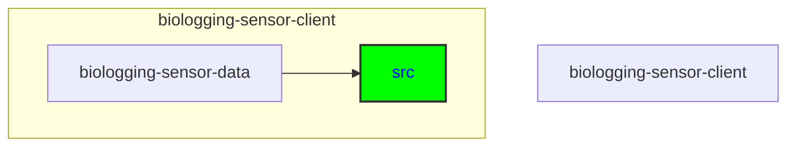

# Git Specificities

## Keywords of folders and files
Git, branching strategy, main branch, develop branch, feature branch, pull request, merge conflicts, code review, approval, commit messages

## Directory
```
biologging-sensor-client\biologging-sensor-data\src
```

```
├───public
└───src
    ├───api
    │   ├───dataset
    │   ├───event
    │   ├───instrument
    │   ├───organism
    │   ├───project
    │   └───record
    ├───app
    │   ├───about
    │   ├───detail
    │   │   └───[id]
    │   └───visualisation
    │       └───[id]
    ├───assets
    │   └───images
    ├───components
    │   ├───graphs
    │   │   ├───actogram
    │   │   ├───line
    │   │   └───map
    │   └───overview
    └───hooks
        └───sensorSelectContext
```





<details>
  <summary><strong>See Further Details</strong></summary>
## Branching Strategy

- **Main Branch**: Contains the stable version of the code ready for production.
- **Develop Branch**: Used for integration and testing of new features before merging into the main branch.

## Workflow

### Pull Latest Changes

Before pushing any changes to the develop branch, ensure your branch is up-to-date by pulling the latest changes.

```bash
git checkout develop
git pull origin develop
```

### Creating a New Feature Branch

For adding a new feature, create a new branch from the develop branch. The branch name should be descriptive of the feature being added.

```bash
git checkout develop
git checkout -b feature/your-feature-name
```

### Making Changes and Committing

Make your changes in the new feature branch and commit them with clear, concise messages.

```bash
git add .
git commit -m "Add new feature: description of feature"
```

### Push Feature Branch

Push the feature branch to the remote repository.

```bash
git push origin feature/your-feature-name
```

### Creating a Pull Request

Create a pull request (PR) from your feature branch to the develop branch for review by other team members.

### Pull Request Process

- **Review**: Every pull request should be reviewed by at least one other team member.
- **Approval**: After the review, if the changes are approved, the pull request can be merged into the develop branch.
- **Merge Conflicts**: If there are merge conflicts, team members should discuss and resolve them before merging.

### Code Review and Approval

Other team members will review the pull request. If approved, the feature branch will be merged into the develop branch. If there are merge conflicts, they will be discussed and resolved among the team members.

---

See how the previous tech team's agreed workflow: [Git Workflow](https://github.com/biodiversitydata-se/biologging-sensor-client/blob/%2311-Architecture-Diagram-Technical-Walkthrough/Git-Workflow.md)

</details>