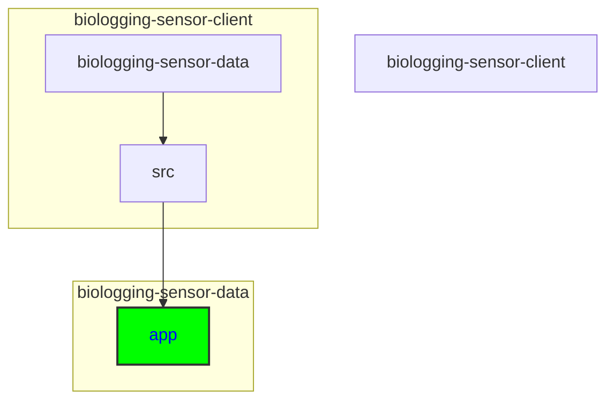

# Updating SBDI Header and Footer Components

## Keywords of folders and files
SBDI, header, footer, Banner.tsx, Footer.tsx, components, styling, layout, navigation links, index.css, layout.tsx

## Directory
```
biologging-sensor-client\biologging-sensor-data\src\app
```

```
├───api
│   ├───dataset
│   ├───event
│   ├───instrument
│   ├───organism
│   ├───project
│   └───record
├───app
│   ├───about
│   ├───detail
│   │   └───[id]
│   └───visualisation
│       └───[id]
├───assets
│   └───images
├───components
│   ├───graphs
│   │   ├───actogram
│   │   ├───line
│   │   └───map
│   └───overview
└───hooks
    └───sensorSelectContext
```




<details>
  <summary><strong>See Further Details</strong></summary>

To update the SBDI header and footer components to reflect changes in styling or layout as per the SBDI guidelines, you'll need to modify the `Banner.tsx` and `Footer.tsx` files in the **componenets** folder. Here's how you can approach it:

## Updating Banner Component (`Banner.tsx`):

### Styling Changes:
To update the styling of the header, you would modify the HTML structure and CSS classes within the `Banner.tsx` file. This involves adjusting the classNames, inline styles, or any other styling attributes to match the SBDI guidelines.

### Importing Stylesheets:

Add any new stylesheet links required for SBDI styling within the <head> section of the `layout.tsx` file. These should follow the SBDI guidelines.

### Layout Changes:
If you need to change the layout of the header, such as repositioning elements or adding/removing components, you would edit the JSX structure within the `Banner.tsx` file. This includes modifying the nested div elements, adding new components, or removing existing ones.

### Link Updates:
If there are changes to the navigation links or their destinations, you would update the `HomeLink`, `DatasetOverviewLink` and `VisualisationLink` components defined in the `links.tsx` file. Ensure that the `href` attributes of the `Link` components point to the correct URLs based on the SBDI guidelines.

## Updating Footer Component (`Footer.tsx`):

### Styling Changes:
Similar to the header, you would update the styling of the footer by modifying the HTML structure and CSS classes within the `Footer.tsx` file. Adjust the classNames, inline styles, or any other styling attributes to match the SBDI guidelines.

### Layout Changes:
To change the layout of the footer, such as adjusting the arrangement of sections or widgets, you would edit the JSX structure within the `Footer.tsx` file. Modify the nested div elements and their classNames accordingly.

### Link Updates:
If there are changes to the footer navigation links or their destinations, you would update the URLs within the `Footer.tsx` file. Ensure that the `href` attributes of anchor (`<a>`) elements point to the correct URLs based on the SBDI guidelines.

### Copyright Year:
If the copyright year needs to be updated dynamically, ensure that the logic for retrieving the current year (`{new Date().getFullYear()}`) remains intact within the `Footer.tsx` file.

## Updating index.css (`index.css`)

### General Styling:

Make adjustments to the existing CSS rules in the `index.css` file to align with the updated SBDI styling guidelines. This may involve modifying font styles, colors, spacing, etc.

### Removing Temporary Styling:

Remove any temporary styling that was added previously and replace it with the finalized styling provided by SBDI guidelines.

### Adding New Styling:

If there are new styling rules provided by the SBDI guidelines, add them to the `index.css` file accordingly.

</details>